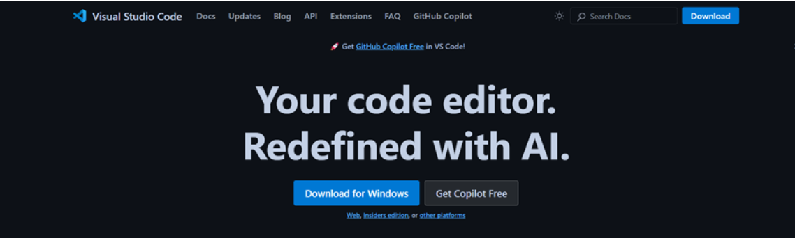
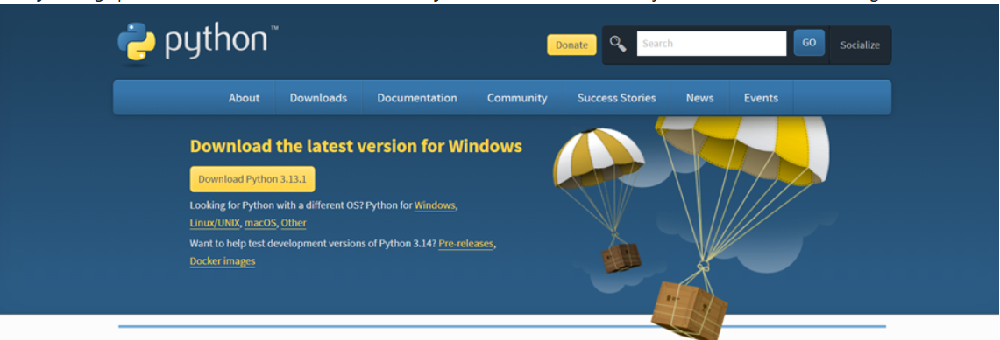
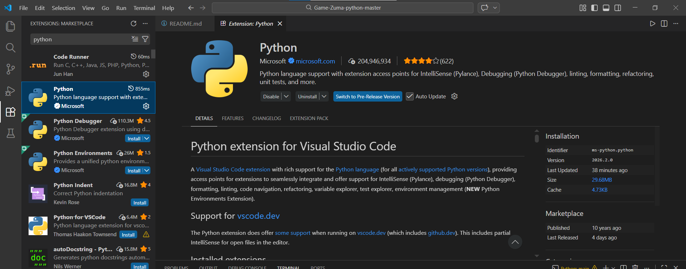
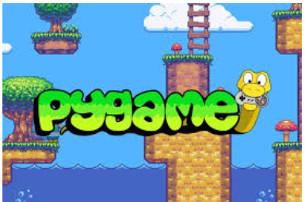
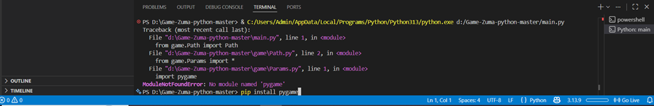
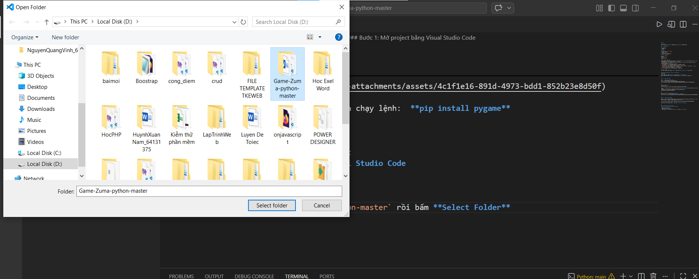
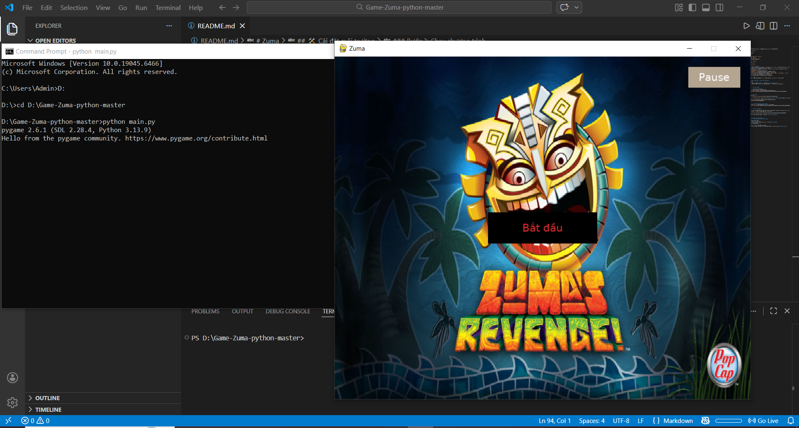
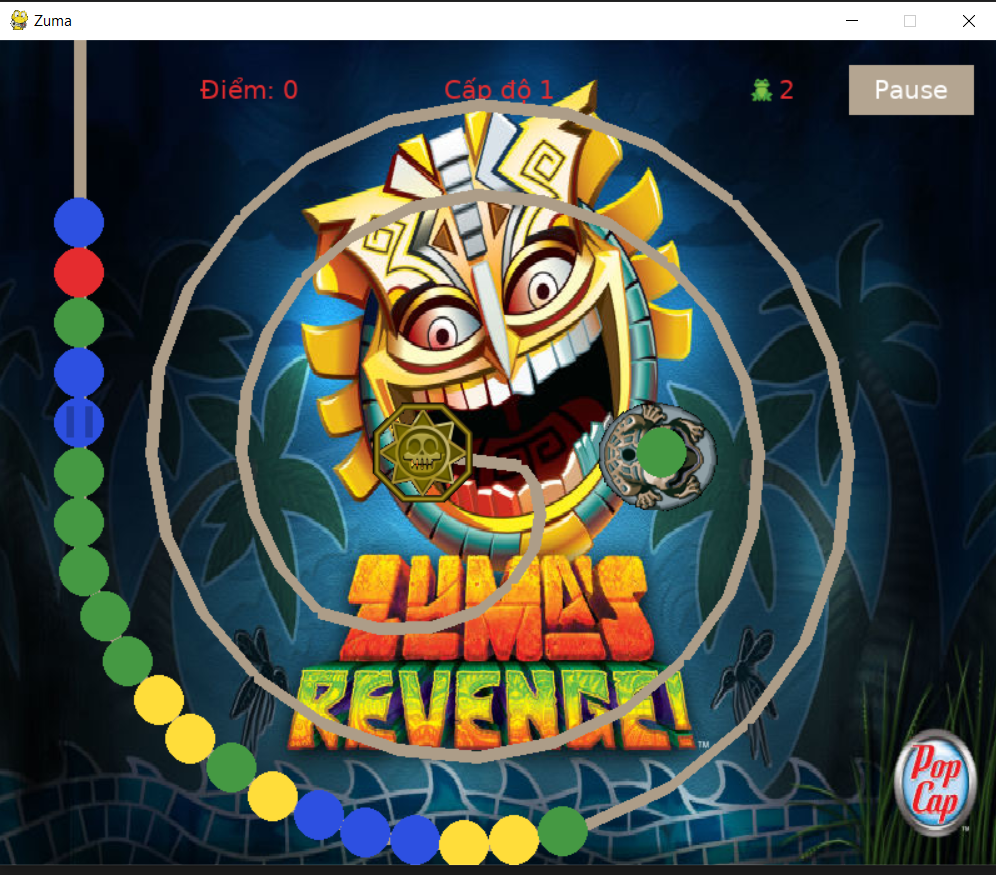

# Zuma

## Описание
Данное приложение является реализацией компьютерной игры «Zuma Deluxe».

Автор: Жукова Дарья

## Требования
* Python 3.8
* pygame

## Состав
* Графическая версия: `main.py`
* Модули: `game/`
* Тесты: `tests.py`
* Изображения: `game/images/`
* Шрифты: `game/fonts/`

## Пример запуска: 
Windows:
`python main.py`
Linux:
`python3 main.py`

## Подробности реализации
Основной файл - main.py. В нём находится основной класс игры `Game` и вспомогательный класс `Level`.
В папке game находятся необходимые для игры модули. 
* `BallGenerator` ответственнен за генерацию и хранение мячей, а так же произведение различных операций над цепочкой мячей
* `ShootingManager` ответственнен за выстрелы
* `BonusManager` ответственнен за генерацию и реализацию бонусов
* `ScoreManager`ответственнен за хранение и подсчет очков и жизней
* `Sprites` хранит все необходимые для игры спрайты (`Player`, `Ball`, `ShootingBall`, `Finish`)
* `Path`генерирует путь в зависимости от текущего уровня
* `Params` хранит в себе все нужные для игры константы
* `ui`ответственнен за отрисову экрана и его составляющих

## Тестирование
На модули в папке game написаны тесты в файле test.py. Покрытие строк составляет 46%

## Game Zuma (Hướng Dẫn Cài Đặt & Chơi Game Zuma) 
Giới thiệu

Project được viết bằng **Python** và chạy trên **Visual Studio Code**.  
Game sử dụng thư viện **Pygame** để tạo giao diện và xử lý tương tác với người chơi.

---

##  Cài đặt môi trường

### 1. Cài đặt Visual Studio Code  
Tải và cài đặt VS Code từ trang chính thức:  
[https://code.visualstudio.com/](https://code.visualstudio.com/)  

---

### 2. Cài đặt Python  
Tải Python tại:  
[https://www.python.org/downloads/](https://www.python.org/downloads/)  

**Lưu ý:** Trong quá trình cài đặt, nhớ tích chọn **Add Python to PATH** để thêm Python vào biến môi trường.  

---

### 3. Cài đặt Python Extension trong VS Code  
Mở VS Code, tìm và cài đặt extension **Python** của Microsoft.  

---

### 4. Cài đặt thư viện Pygame

Pygame là một thư viện Python rất phổ biến để phát triển game 2D, cung cấp các công cụ để xử lý đồ họa, âm thanh, và tương tác người dùng một cách dễ dàng.

Mở terminal hoặc Command Prompt và chạy lệnh:  **pip install pygame**

---

### 5. Hướng dẫn thực hiện Project
### Bước 1: Tải và giải nén project
Tải project về máy và giải nén file ZIP.

### Bước 2: Mở project bằng Visual Studio Code

- Mở Visual Studio Code
- Chọn **File → Open Folder**
- Chọn thư mục `d:\Game-Zuma-python-master` rồi bấm **Select Folder**

### Bước 3: Chạy chương trình

- Tìm file `main.py` trong thư mục project.
- Chạy file này bằng cách nhấn **Run** hoặc mở terminal và chạy câu lệnh: **python main.py**

###  6. Mô tả cách chơi
Game Zuma là một trò chơi giải đố hành động rất nổi tiếng, do PopCap Games phát triển và phát hành lần đầu vào năm 2003.

- Trong game, người chơi điều khiển một chú ếch đá đứng ở giữa màn hình. Người chơi bắt đầu bằng cách nhấn **con trỏ chuột** trên màn hình di chuyển tất cả các góc để bắn quả bóng di chuyển vào chuỗi bi màu đang di chuyển tạo thành chuỗi bi trên đường đi.
- Khi quả bóng sẽ liên tục di chuyển và có 3 viên cùng màu trở lên nối liền nhau phía trên màn hình chúng sẽ biến mất phá huỷ cũng màu và mất đi.
- Nếu chuỗi bi đi hết đường và rơi vào hố cuối thì kết quả dẫn đến thua cuộc ngược lại phá hết tất cả cùng màu các viên bi chưa đến đích kết quả dẫn đến thắng.
- **Mục tiêu** là phá vỡ hết toàn bộ chuỗi bi trước khi chúng đến đích trên màn hình.
### Cơ chế chơi chi tiết:
- Mỗi khi bóng tạo thành chuỗi 3 viên bi, viên bi sẽ được xoá bỏ, người chơi nhận điểm.
- Trong quá trình chơi có 3 cấp độ:
- Đường xoắn ốc , đường vuông , đường tam giác.
- Trong quá trình chơi, người chơi có thể nhận được **loại vật phẩm** , bao gồm:
  - Tăng tốc cơ chế bắn đạn
  - Vật phẩm bom nổ phá hết chuỗi
  - Tự động dừng hiệu lực của phần thưởng 
  - Phần thưởng trạng thái di chuyển ngược của quả bóng
  - Tăng số mạng (tối đa 3 mạng) --> Tăng mạng sống khi điểm số đạt bội số của 500.

- Người chơi cần  điều khiển con ếch để bắn bóng vào chuỗi bên trong để tạo chuỗi bi phá nổ. Nếu để bi rơi ra ngoài, chuỗi bi sẽ di chuyển đến đích sẽ thua người chơi sẽ mất một mạng.
- Nếu người chơi phá hết chuỗi bi được di chuyển trên đường đi, sẽ tăng độ khó qua một cấp độ khác của trò chơi.
### Kết thúc trò chơi:

- Trò chơi kết thúc khi:
  - Tất cả đường bóng tạo chuỗi bi được phá hủy, hoặc
  - Người chơi mất hết mạng.
- Điểm cao nhất sẽ được lưu lại.
- Màn hình kết thúc sẽ cho phép người chơi chọn **trò chơi mới**  **bắt đầu lại** hoặc **kết thúc**.

---

